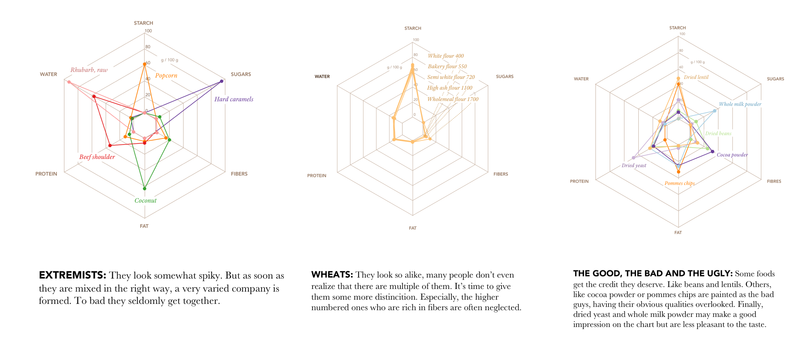

# Nutrient visualization

This project visualizes nutrients from different foods. The data source is the
[Swiss Food Composition Database](http://www.naehrwertdaten.ch/request?xml=MessageData&xml=MetaData&xsl=Start&lan=de&pageKey=Start).

## Result

## Database schema
The database contains information on a vast range of nutrients which are listed here:

* name D
* synonyms D
* category D
* specific gravity
* energy kJ
* energy kcal
* protein
* alcohol
* water
* carbohydrates, available
* starch
* sugars
* dietary fibres
* fat, total
* cholesterol
* fatty acids, monounsaturated
* fatty acids, saturated
* fatty acids, polyunsaturated
* vitamin A activity
* all-trans retinol equivalents
* beta-carotene activity
* beta-carotene
* vitamin B1 (thiamine)
* vitamin B2 (riboflavin)
* vitamin B6 (pyridoxine)
* vitamin B12 (cobalamin)
* niacin
* folate
* pantothenic acid
* vitamin C (ascorbic acid)
* vitamin D (calciferol)
* vitamin E activity
* sodium (Na)
* potassium (K)
* chloride (Cl)
* calcium (Ca)
* magnesium (Mg)
* phosphorus (P)
* iron (Fe)
* iodide (I)
* zinc (Zn)
